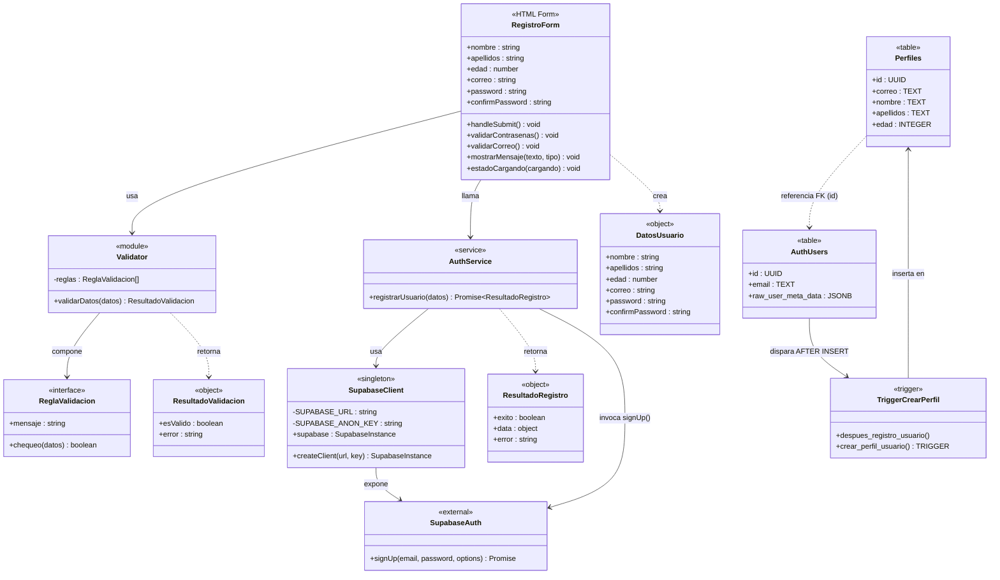

# Diagrama de Clases del Sistema

```mermaid
classDiagram
    direction TB

    class RegistroForm {
        <<HTML Form>>
        +nombre : string
        +apellidos : string
        +edad : number
        +correo : string
        +password : string
        +confirmPassword : string
        +handleSubmit() void
        +validarContrasenas() void
        +validarCorreo() void
        +mostrarMensaje(texto, tipo) void
        +estadoCargando(cargando) void
    }

    class Validator {
        <<module>>
        -reglas : ReglaValidacion[]
        +validarDatos(datos) ResultadoValidacion
    }

    class ReglaValidacion {
        <<interface>>
        +chequeo(datos) boolean
        +mensaje : string
    }

    class ResultadoValidacion {
        <<object>>
        +esValido : boolean
        +error : string
    }

    class DatosUsuario {
        <<object>>
        +nombre : string
        +apellidos : string
        +edad : number
        +correo : string
        +password : string
        +confirmPassword : string
    }

    class AuthService {
        <<service>>
        +registrarUsuario(datos) Promise~ResultadoRegistro~
    }

    class ResultadoRegistro {
        <<object>>
        +exito : boolean
        +data : object
        +error : string
    }

    class SupabaseClient {
        <<singleton>>
        -SUPABASE_URL : string
        -SUPABASE_ANON_KEY : string
        +supabase : SupabaseInstance
        +createClient(url, key) SupabaseInstance
    }

    class SupabaseAuth {
        <<external>>
        +signUp(email, password, options) Promise
    }

    class Perfiles {
        <<table>>
        +id : UUID
        +correo : TEXT
        +nombre : TEXT
        +apellidos : TEXT
        +edad : INTEGER
    }

    class AuthUsers {
        <<table>>
        +id : UUID
        +email : TEXT
        +raw_user_meta_data : JSONB
    }

    class TriggerCrearPerfil {
        <<trigger>>
        +despues_registro_usuario()
        +crear_perfil_usuario() TRIGGER
    }

    RegistroForm --> Validator : usa
    RegistroForm --> AuthService : llama
    RegistroForm ..> DatosUsuario : crea
    Validator --> ReglaValidacion : compone
    Validator ..> ResultadoValidacion : retorna
    AuthService --> SupabaseClient : usa
    AuthService ..> ResultadoRegistro : retorna
    SupabaseClient --> SupabaseAuth : expone
    AuthService --> SupabaseAuth : invoca signUp()
    AuthUsers --> TriggerCrearPerfil : dispara AFTER INSERT
    TriggerCrearPerfil --> Perfiles : inserta en
    Perfiles ..> AuthUsers : referencia FK (id)
```
